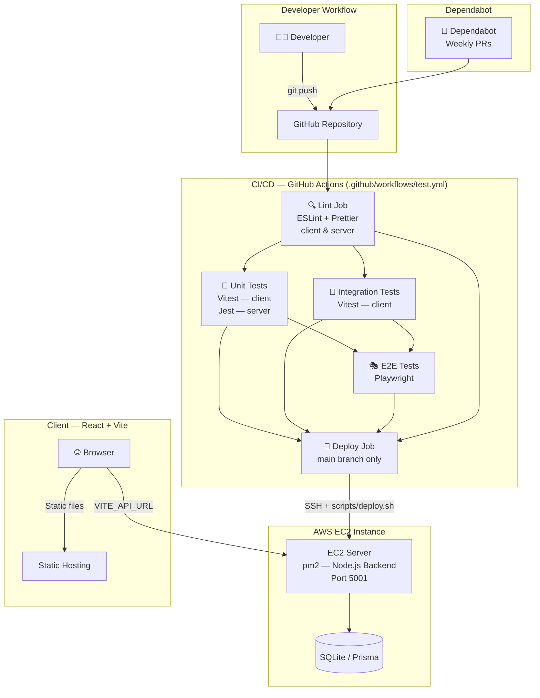

# ShopSmart

> A full-stack DevOps-ready shopping application with CI/CD, automated testing, and AWS EC2 deployment.

---

## Architecture



---

## Project Structure

```
shopsmart-Devops/
├── .github/
│   ├── workflows/
│   │   └── test.yml          # CI/CD pipeline (lint → test → deploy)
│   └── dependabot.yml        # Weekly dependency update PRs
│
├── client/                   # React + Vite frontend
│   ├── src/
│   │   ├── components/       # Reusable UI components
│   │   │   ├── ErrorBoundary.jsx
│   │   │   ├── LoadingSpinner.jsx
│   │   │   └── StatusCard.jsx
│   │   ├── pages/            # Page-level components
│   │   │   └── HomePage.jsx
│   │   ├── services/         # Public API service layer
│   │   │   └── api.js
│   │   ├── helpers/          # Internal utilities
│   │   │   ├── api.js
│   │   │   ├── formatters.js
│   │   │   └── validators.js
│   │   └── __tests__/
│   │       ├── unit/         # Vitest unit tests
│   │       └── integration/  # Vitest integration tests
│   └── e2e/                  # Playwright E2E tests
│       └── app.spec.js
│
├── server/                   # Express.js backend
│   ├── src/
│   │   ├── index.js          # Entry point
│   │   └── app.js            # Express app + routes
│   └── tests/
│       └── app.test.js       # Jest + Supertest tests
│
├── scripts/
│   └── deploy.sh             # Idempotent EC2 deploy script
│
└── README.md
```

---

## Local Development

### Prerequisites

- Node.js 20+
- npm 9+

### Running the backend

```bash
cd server
npm install
npm run dev        # starts on http://localhost:5001
```

### Running the frontend

```bash
cd client
npm install
npm run dev        # starts on http://localhost:5173
```

Set `VITE_API_URL` in `client/.env.local` to point to the backend:

```
VITE_API_URL=http://localhost:5001
```

---

## Testing

### Backend — Jest + Supertest

```bash
cd server && npm test
```

Covers: `GET /api/health` (status, shape, timestamp), `GET /`, and 404 unknown routes — **10 tests**.

### Frontend Unit Tests — Vitest

```bash
cd client && npm run test:unit
```

Covers: `handleApiError`, `formatTimestamp`, `formatStatus`, `truncateText`, `formatCurrency`.

### Frontend Integration Tests — Vitest + Testing Library

```bash
cd client && npm run test:integration
```

Covers: App loading/error/success states, fetch mock integration.

### E2E Tests — Playwright

```bash
cd client && npm run test:e2e
```

Covers: 10 full user-flow scenarios (page load, spinner, status display, error handling, responsive at 375px).

### Run everything

```bash
cd server && npm test
cd client && npm run test:all
```

---

## Lint & Formatting

Both `client/` and `server/` have ESLint + Prettier configured with `--max-warnings 0`. PRs **fail CI** if any lint or format check fails.

```bash
# Client
cd client && npm run lint && npm run format:check

# Server
cd server && npm run lint && npm run format:check
```

---

## CI/CD Pipeline

The pipeline runs on every push and PR across all branches:

```
push/PR → Lint ─┬─▶ Client Unit Tests ─┐
                ├─▶ Client Int. Tests  ─┼─▶ E2E Tests ─┐
                └─▶ Server Tests ───────┘               │
                                                        ▼
                              (main branch only) → Deploy to EC2
```

| Job | Trigger | Description |
|---|---|---|
| `lint` | All branches | ESLint + Prettier (client + server) |
| `client-unit-tests` | After lint | Vitest unit tests |
| `client-integration-tests` | After lint | Vitest integration tests |
| `server-tests` | After lint | Jest + Supertest API tests |
| `e2e-tests` | After unit + integration | Playwright browser tests |
| `deploy` | `main` push only | SSH → EC2 → `deploy.sh` |

---

## Deployment to AWS EC2

### Setup

1. Launch an EC2 instance (Ubuntu 22.04 recommended)
2. Install Node.js 20, npm, pm2, and git on the instance
3. Clone the repo: `git clone <your-repo-url> /home/ubuntu/shopsmart`
4. Add the following **GitHub Secrets** in your repo settings:

| Secret | Value |
|---|---|
| `EC2_HOST` | EC2 public IP or hostname |
| `EC2_USER` | SSH user (e.g. `ubuntu`) |
| `EC2_SSH_KEY` | Contents of your `.pem` private key |
| `EC2_APP_DIR` | App path on EC2 (e.g. `/home/ubuntu/shopsmart`) |

### How it works

On every push to `main`, after all tests pass, GitHub Actions:

1. SSHs into EC2 using [`appleboy/ssh-action`](https://github.com/appleboy/ssh-action)
2. Runs `scripts/deploy.sh` which:
   - `git pull origin main` — fetches latest code
   - `npm install --prefer-offline` — installs deps (idempotent)
   - `npm run build` — builds the frontend
   - `npx prisma migrate deploy` — applies pending DB migrations safely
   - `pm2 reload shopsmart` — zero-downtime restart (falls back to `pm2 start`)

### Manual deploy

```bash
export APP_DIR=/home/ubuntu/shopsmart
bash $APP_DIR/scripts/deploy.sh
```

---

## 8. Dependabot Configuration

Configured in `.github/dependabot.yml` to auto-check for outdated dependencies and open weekly PRs for:

- `client/` npm dependencies
- `server/` npm dependencies
- GitHub Actions action versions

---

## Design Decisions

| Decision | Rationale |
|---|---|
| **Monorepo** (`client/` + `server/`) | Single repo simplifies CI, shared secrets, and Dependabot config |
| **Vite + React** | Fastest dev server, native ESM, excellent Vitest integration |
| **Express.js** | Minimal, production-proven, easy to test with Supertest |
| **Vitest** | Native Vite integration — no Babel config, same ESM context as the app |
| **Playwright** | Cross-browser E2E with built-in request mocking; no extra mock server needed |
| **pm2** | Process manager for zero-downtime restarts and automatic restarts on crash |
| **`appleboy/ssh-action`** | Battle-tested GitHub Action for SSH deploys; no need to manage SSH CLI manually |
| **Idempotent scripts** | All deploy steps are safe to re-run — `npm install --prefer-offline`, `prisma migrate deploy`, `pm2 reload \|\| pm2 start` |

---

## Challenges & How They Were Resolved

| Challenge | Resolution |
|---|---|
| E2E tests failing because API isn't mocked | Used Playwright's `page.route()` to intercept and mock `/api/health` — no real backend needed in CI |
| Integration tests importing ESM modules in Vitest | Configured `vite.config.js` with `test.environment: 'jsdom'` and `setupTests.js` for `@testing-library/jest-dom` |
| Lint failing on server's CommonJS globals | Added `require`, `module`, `exports`, and Jest globals explicitly in `eslint.config.mjs` |
| Deploy script failing partway through | Added `set -euo pipefail` to `deploy.sh` so any failed command aborts the script immediately |
| Dependabot opening too many PRs | Set `open-pull-requests-limit: 10` and weekly (not daily) schedule |
